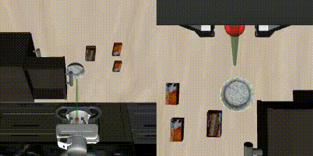
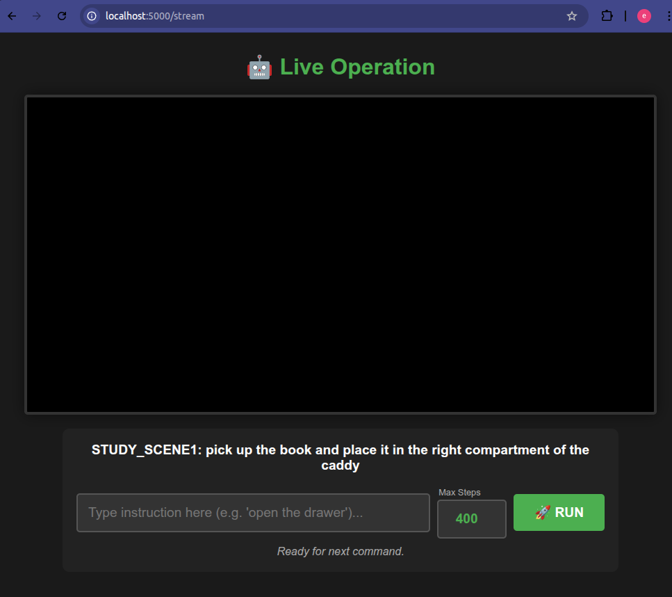

# FlowerVLA on Libero (Docker)

This is a Dockerized implementation of FlowerVLA for the Libero env inference.




Original Repository: https://github.com/intuitive-robots/flower_vla_calvin

Currently using the **FLOWER VLA libero_90** model: https://huggingface.co/mbreuss/flower_libero_90

## Prerequisites

- **OS:** Linux (Ubuntu 20.04/22.04 recommended)
- **Storage:** At least **44GB** of free disk space
- **GPU:** NVIDIA GPU (>4GB VRAM recommended) with drivers installed
- **Software:** Docker & [NVIDIA Container Toolkit](https://docs.nvidia.com/datacenter/cloud-native/container-toolkit/install-guide.html) installed.

## Installisation and usage

You don't need to clone the code (it's all inside the Docker image), but you need a directory for the output videos.

```
git clone https://github.com/Bigenlight/Flower_VLA_for_libero_in_Docker.git

cd Flower_VLA_for_libero_in_Docker

mkdir -p interactive_logs
```

- Pull image (download may take time)

```
docker pull bigenlight/flower_vla:v9
```

- Start the Robot Server

```
docker run -itd \
  --name flower_vla \
  --gpus all \
  -p 5000:5000 \
  -v $(pwd)/interactive_logs:/app/interactive_logs \
  bigenlight/flower_vla:v9 \
  /bin/bash
```

- Enter the container

```
docker exec -it flower_vla /bin/bash
```

- Inside container, run the code for launching Libero inference

```
python run_robot.py
```

### How to control



Once the script is running:

1. Open your browser (Chrome/Firefox) on your host machine.

1. Go to: http://localhost:5000

1. Wait for Initialization (~3-4 minutes).

1. Choose any of the 90 Libero scenes from the list.

1. Type natural language commands and set the max steps(inference length) and click Run.

1. Videos are automatically saved to the interactive_logs/ folder on your host machine.

<br>

## Citation (from original page)

If you found the code usefull, please cite our work:

```bibtex
@inproceedings{
reuss2025flower,
title={{FLOWER}: Democratizing Generalist Robot Policies with Efficient Vision-Language-Flow Models},
author={Moritz Reuss and Hongyi Zhou and Marcel R{\"u}hle and {\"O}mer Erdin{\c{c}} Ya{\u{g}}murlu and Fabian Otto and Rudolf Lioutikov},
booktitle={9th Annual Conference on Robot Learning},
year={2025},
url={https://openreview.net/forum?id=JeppaebLRD}
}
```
